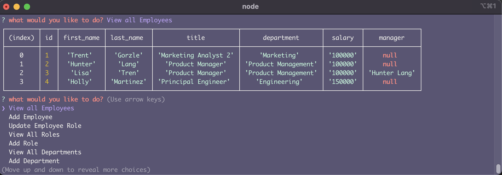
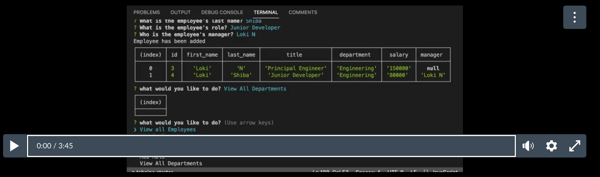

# Employee Tracker
## Description
This is a command line application written in Node JS to track employees for a company. This application is the front end of a MySQL database. You can use it to create departments, roles with salaries, and employees with roles and managers.

## How to use this application
1. pull this repository and run npm install in the root directory
2. run `node app` to start the application
3. create a new department
4. create a new role
5. add an employee with the created role - The first employee cannot have a manager
   
## Screenshot

## Video
[Video Link Here](https://bootcampspot.instructuremedia.com/embed/f8df65e1-a84d-4e3f-a9ef-df82bf473473)

